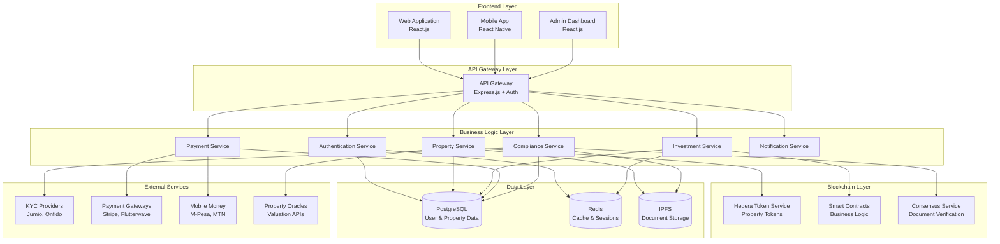

# Design Document

## Overview

GlobalLand is a comprehensive real estate tokenization platform built on Hedera Hashgraph that enables fractional ownership of global real estate assets. The platform leverages Hedera's native Token Service (HTS), Smart Contract Service (HSCS), and Consensus Service (HCS) to create a secure, scalable, and cost-effective solution for real estate investment.

The architecture follows a microservices pattern with clear separation between blockchain operations, business logic, and user interfaces. The system is designed to handle high transaction volumes while maintaining regulatory compliance and providing an exceptional user experience across web and mobile platforms.

## Architecture

### High-Level System Architecture



### Blockchain Architecture

The platform utilizes three core Hedera services:

1. **Hedera Token Service (HTS)**: Native tokenization of real estate properties
2. **Hedera Smart Contract Service (HSCS)**: Business logic and governance
3. **Hedera Consensus Service (HCS)**: Document timestamping and audit trails

### Service Architecture

Each microservice is containerized and deployed independently, enabling:
- Horizontal scaling based on demand
- Independent deployment and updates
- Fault isolation and resilience
- Technology stack flexibility per service

## Components and Interfaces

### 1. Property Tokenization Engine

**Purpose**: Converts real estate assets into HTS tokens with proper metadata and compliance.

**Key Components**:
- Property validation and due diligence workflow
- HTS token creation and configuration
- Metadata management and IPFS storage
- Legal document verification via HCS

**Interface**:
```typescript
interface PropertyTokenizationService {
  createPropertyToken(property: PropertyDetails): Promise<TokenId>
  validateProperty(property: PropertyDetails): Promise<ValidationResult>
  uploadDocuments(documents: Document[]): Promise<string[]>
  setTokenMetadata(tokenId: TokenId, metadata: PropertyMetadata): Promise<void>
}
```

### 2. Investment Management System

**Purpose**: Handles fractional investment purchases, portfolio tracking, and secondary market operations.

**Key Components**:
- Investment purchase workflow
- Portfolio calculation and tracking
- Secondary market order matching
- Performance analytics

**Interface**:
```typescript
interface InvestmentService {
  purchaseTokens(userId: string, tokenId: TokenId, amount: number): Promise<Transaction>
  getPortfolio(userId: string): Promise<Portfolio>
  createSellOrder(userId: string, tokenId: TokenId, amount: number, price: number): Promise<Order>
  matchOrders(buyOrder: Order, sellOrder: Order): Promise<Trade>
}
```

### 3. Payment Processing System

**Purpose**: Multi-currency payment handling with mobile money integration.

**Key Components**:
- Currency conversion and rate management
- Payment gateway integration
- Mobile money API integration
- Transaction reconciliation

**Interface**:
```typescript
interface PaymentService {
  processPayment(payment: PaymentRequest): Promise<PaymentResult>
  convertCurrency(amount: number, from: Currency, to: Currency): Promise<number>
  initiateMobilePayment(request: MobilePaymentRequest): Promise<PaymentResult>
  getExchangeRates(): Promise<ExchangeRates>
}
```

### 4. Dividend Distribution System

**Purpose**: Automated rental income distribution to token holders.

**Key Components**:
- Proportional calculation engine
- Batch payment processing
- Fee deduction and management
- Distribution history tracking

**Interface**:
```typescript
interface DividendService {
  calculateDistribution(tokenId: TokenId, totalIncome: number): Promise<Distribution[]>
  distributeDividends(tokenId: TokenId, distributions: Distribution[]): Promise<void>
  getDistributionHistory(tokenId: TokenId): Promise<DistributionHistory[]>
  setManagementFees(tokenId: TokenId, feePercentage: number): Promise<void>
}
```

### 5. Compliance and KYC System

**Purpose**: Regulatory compliance, user verification, and audit trail management.

**Key Components**:
- Multi-provider KYC integration
- AML screening and monitoring
- Regulatory reporting
- Audit trail via HCS

**Interface**:
```typescript
interface ComplianceService {
  verifyUser(userId: string, documents: KYCDocuments): Promise<VerificationResult>
  performAMLCheck(userId: string, transaction: Transaction): Promise<AMLResult>
  generateComplianceReport(startDate: Date, endDate: Date): Promise<ComplianceReport>
  recordAuditEvent(event: AuditEvent): Promise<void>
}
```

## Data Models

### Core Entities

```typescript
// Property Entity
interface Property {
  id: string
  tokenId: TokenId
  name: string
  description: string
  location: Address
  valuation: number
  totalTokens: number
  availableTokens: number
  pricePerToken: number
  expectedYield: number
  propertyType: PropertyType
  documents: Document[]
  status: PropertyStatus
  createdAt: Date
  updatedAt: Date
}

// User Entity
interface User {
  id: string
  email: string
  walletAddress: string
  kycStatus: KYCStatus
  verificationLevel: VerificationLevel
  portfolio: Portfolio
  preferences: UserPreferences
  createdAt: Date
  updatedAt: Date
}

// Investment Entity
interface Investment {
  id: string
  userId: string
  propertyId: string
  tokenAmount: number
  purchasePrice: number
  purchaseDate: Date
  currentValue: number
  totalDividends: number
  status: InvestmentStatus
}

// Transaction Entity
interface Transaction {
  id: string
  userId: string
  type: TransactionType
  amount: number
  currency: Currency
  status: TransactionStatus
  blockchainTxId: string
  createdAt: Date
  completedAt?: Date
}
```

### Smart Contract Data Structures

```solidity
// Property Token Structure
struct PropertyToken {
    uint256 tokenId;
    string propertyId;
    uint256 totalSupply;
    uint256 pricePerToken;
    address propertyManager;
    uint256 managementFee;
    bool dividendsEnabled;
    mapping(address => uint256) balances;
    mapping(address => bool) accreditedInvestors;
}

// Dividend Distribution Structure
struct DividendDistribution {
    uint256 tokenId;
    uint256 totalAmount;
    uint256 distributionDate;
    uint256 pricePerToken;
    mapping(address => uint256) claimedAmounts;
    mapping(address => bool) hasClaimed;
}
```

## Error Handling

### Error Categories

1. **Blockchain Errors**: Network issues, insufficient gas, transaction failures
2. **Business Logic Errors**: Invalid investments, compliance violations, insufficient funds
3. **External Service Errors**: KYC provider failures, payment gateway issues
4. **System Errors**: Database connectivity, service unavailability

### Error Handling Strategy

```typescript
// Centralized Error Handler
class ErrorHandler {
  static handle(error: Error, context: string): ErrorResponse {
    if (error instanceof BlockchainError) {
      return this.handleBlockchainError(error, context)
    }
    if (error instanceof BusinessLogicError) {
      return this.handleBusinessError(error, context)
    }
    if (error instanceof ExternalServiceError) {
      return this.handleExternalError(error, context)
    }
    return this.handleSystemError(error, context)
  }
}

// Retry Mechanism for Blockchain Operations
class RetryableOperation {
  static async execute<T>(
    operation: () => Promise<T>,
    maxRetries: number = 3,
    backoffMs: number = 1000
  ): Promise<T> {
    for (let attempt = 1; attempt <= maxRetries; attempt++) {
      try {
        return await operation()
      } catch (error) {
        if (attempt === maxRetries) throw error
        await this.delay(backoffMs * attempt)
      }
    }
  }
}
```

### Circuit Breaker Pattern

```typescript
class CircuitBreaker {
  private failures = 0
  private lastFailureTime = 0
  private state: 'CLOSED' | 'OPEN' | 'HALF_OPEN' = 'CLOSED'
  
  async execute<T>(operation: () => Promise<T>): Promise<T> {
    if (this.state === 'OPEN') {
      if (Date.now() - this.lastFailureTime > this.timeout) {
        this.state = 'HALF_OPEN'
      } else {
        throw new Error('Circuit breaker is OPEN')
      }
    }
    
    try {
      const result = await operation()
      this.onSuccess()
      return result
    } catch (error) {
      this.onFailure()
      throw error
    }
  }
}
```

## Testing Strategy

### Testing Pyramid

1. **Unit Tests (70%)**
   - Individual service methods
   - Smart contract functions
   - Utility functions and helpers
   - Data validation logic

2. **Integration Tests (20%)**
   - Service-to-service communication
   - Database operations
   - External API integrations
   - Blockchain interactions

3. **End-to-End Tests (10%)**
   - Complete user workflows
   - Cross-service transactions
   - UI automation tests
   - Performance testing

### Smart Contract Testing

```solidity
// Test Contract Example
contract PropertyTokenTest {
    PropertyToken propertyToken;
    
    function setUp() public {
        propertyToken = new PropertyToken();
    }
    
    function testTokenCreation() public {
        uint256 tokenId = propertyToken.createPropertyToken(
            "PROP001",
            1000000, // total supply
            100,     // price per token
            msg.sender
        );
        
        assertEq(propertyToken.totalSupply(tokenId), 1000000);
        assertEq(propertyToken.pricePerToken(tokenId), 100);
    }
    
    function testDividendDistribution() public {
        // Test dividend calculation and distribution
        uint256 tokenId = 1;
        uint256 totalDividend = 10000;
        
        propertyToken.distributeDividends(tokenId, totalDividend);
        
        // Verify distribution calculations
        uint256 userDividend = propertyToken.calculateUserDividend(
            tokenId, 
            msg.sender
        );
        
        assertTrue(userDividend > 0);
    }
}
```

### API Testing Strategy

```typescript
// API Integration Test Example
describe('Investment API', () => {
  it('should complete investment purchase flow', async () => {
    // 1. Create test user and verify KYC
    const user = await createTestUser()
    await completeKYC(user.id)
    
    // 2. Create test property token
    const property = await createTestProperty()
    
    // 3. Process investment purchase
    const investment = await investmentService.purchaseTokens(
      user.id,
      property.tokenId,
      100 // token amount
    )
    
    // 4. Verify blockchain transaction
    expect(investment.status).toBe('COMPLETED')
    expect(investment.blockchainTxId).toBeDefined()
    
    // 5. Verify portfolio update
    const portfolio = await investmentService.getPortfolio(user.id)
    expect(portfolio.investments).toHaveLength(1)
  })
})
```

### Performance Testing

- **Load Testing**: Simulate 1000+ concurrent users
- **Stress Testing**: Test system limits and failure points
- **Blockchain Performance**: Measure transaction throughput and latency
- **Database Performance**: Query optimization and connection pooling

The design ensures scalability, security, and regulatory compliance while providing a seamless user experience for global real estate investment through blockchain tokenization.